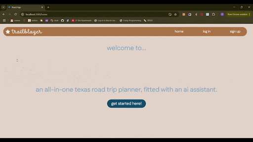
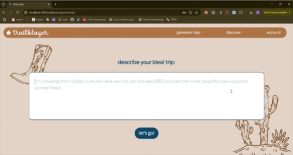
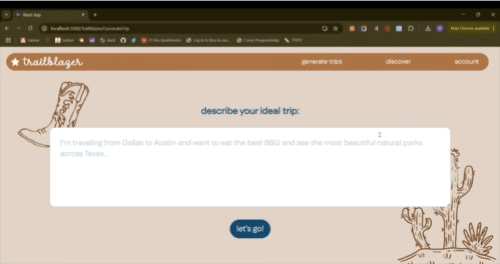

# Trailblazer

Trailblazer is a website that creates a road trip itinerary from the user's prompt. Users can save their itinerary to their account, made possible using Firebase/Firestore. Users may also discover trips other users have taken around Texas. We use OpenAI's 4o-mini model and the Google Maps API, along with React.js on the frontend and Firebase/Firestore on the backend.

## Site Demos

### Generating a Trip 

### Discovering User's Trips
